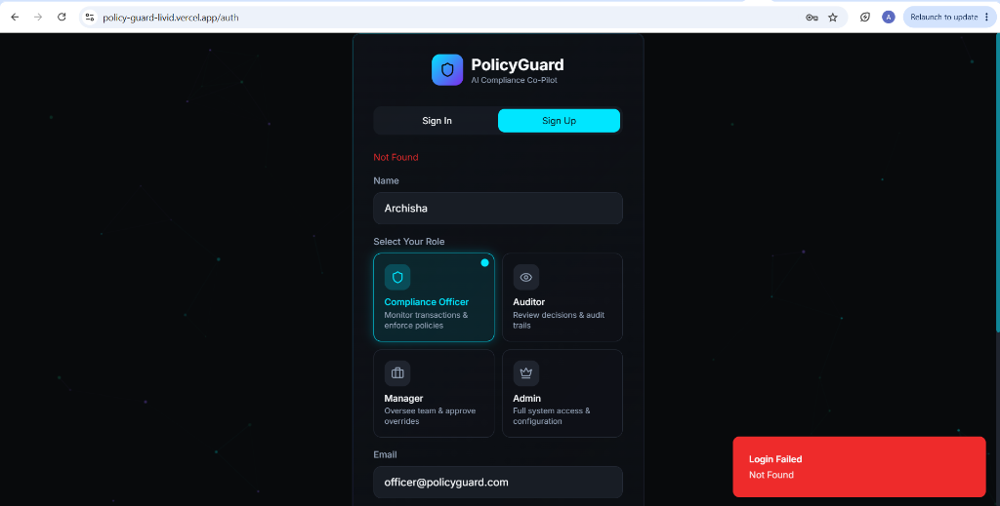
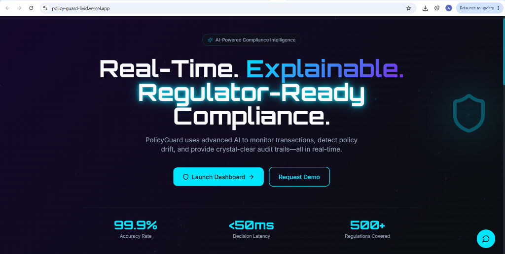
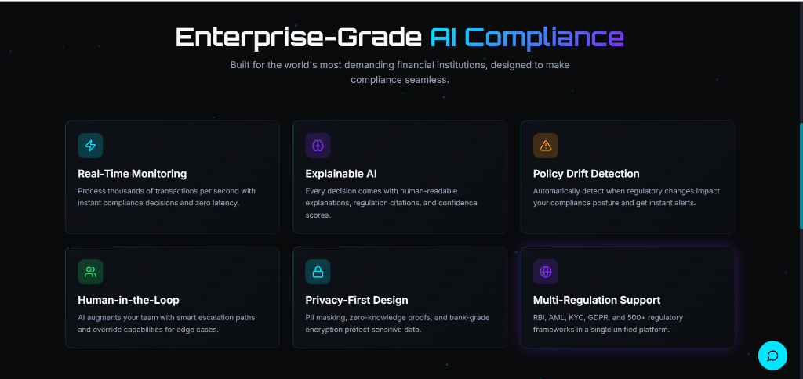
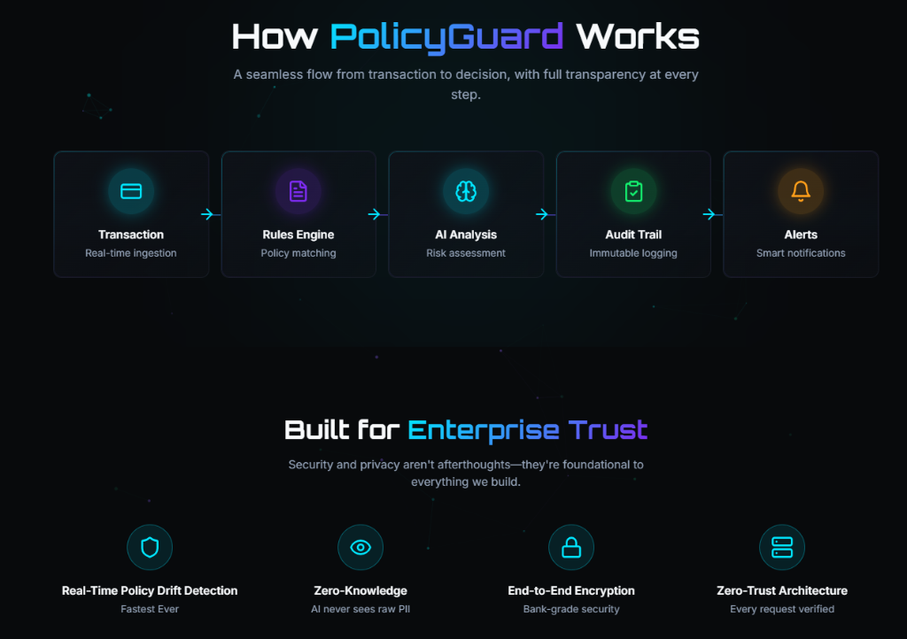
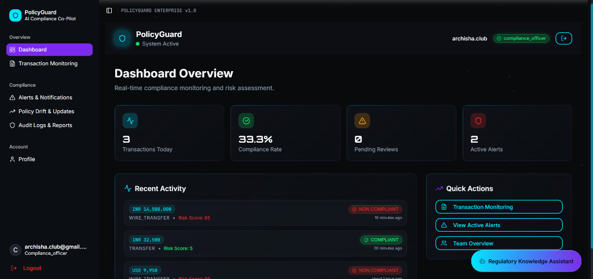
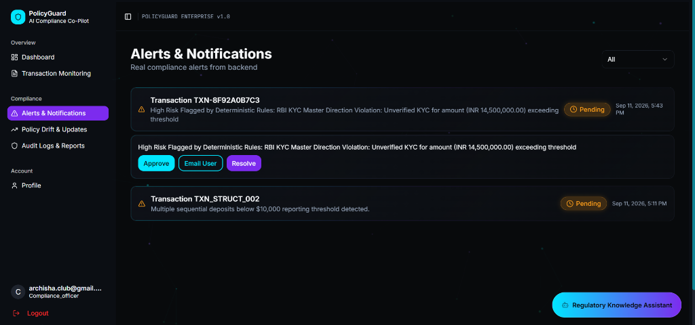
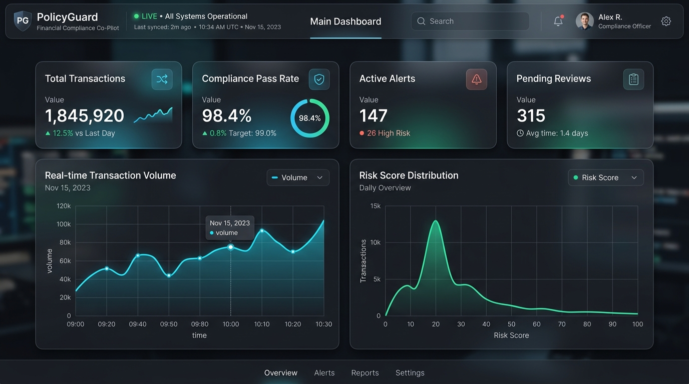
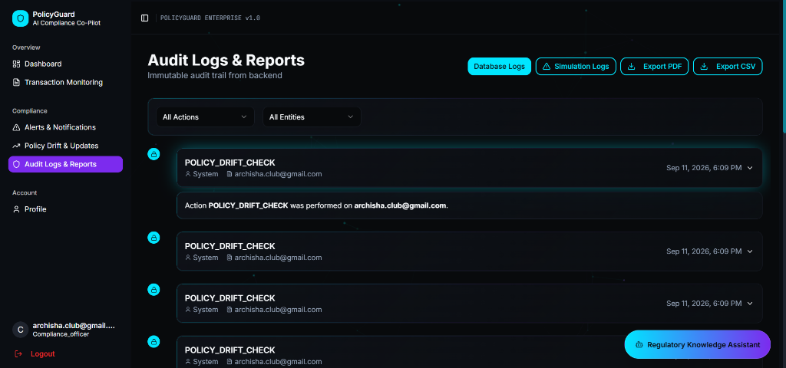
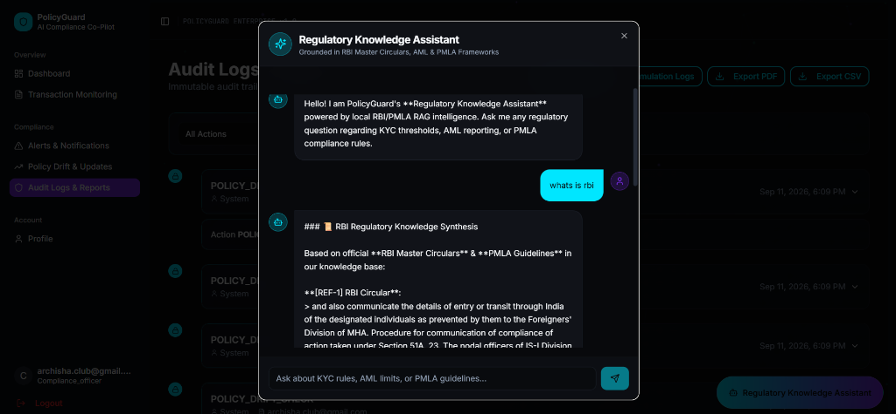

# 🛡️ POLICYGUARD

> **Tagline**: Real-Time, Explainable & Privacy-First Financial Compliance Co-Pilot

POLICYGUARD is an enterprise-grade, real-time financial compliance co-pilot for banks, fintechs, payment gateways, and regulated financial institutions. It combines **Deterministic Rule Engines**, **Self-Hosted Local Vector RAG**, **Explainable AI Compliance Reasoning**, **PII Masking & Tokenization**, **Human-in-the-Loop Governance**, **Cryptographic Audit Trails**, and **Regulatory Drift Detection**.

---

## 🌐 Live Production Deployments

| Component | Status | URL |
| :--- | :--- | :--- |
| **Frontend Application** | 🟢 Live | [https://policy-guard-livid.vercel.app](https://policy-guard-livid.vercel.app) |
| **Backend API** | 🟢 Live | [https://policy-guard.onrender.com](https://policy-guard.onrender.com) |
| **Interactive API Specs** | 🟢 Swagger UI | [https://policy-guard.onrender.com/docs](https://policy-guard.onrender.com/docs) |

---

## 🚨 Problem Statement & 💡 Solution

### The Challenge
1. **Skyrocketing Regulatory Burden**: Financial institutions struggle with hundreds of evolving RBI, PMLA, FATF, and KYC/AML circulars and guidelines.
2. **High False Positive Alert Fatigue**: Traditional legacy rule engines generate massive false positives (>90%), overwhelming compliance officers and delaying legitimate transactions.
3. **Black-Box Cloud AI & Hallucinations**: Standard LLMs hallucinate non-existent compliance rules and lack auditability, citations, and regulatory explainability.
4. **PII Data Privacy Risks**: Sending unmasked customer PANs, Aadhaar numbers, and bank account numbers to cloud AI providers violates financial data sovereignty laws.

### The PolicyGuard Solution
> [!IMPORTANT]
> **PolicyGuard Philosophy**: *"AI assists compliance officers; AI does not replace them."*

PolicyGuard addresses these challenges through a multi-layered hybrid architecture:
- **Zero-Cost / Self-Hosted RAG**: 100% self-hosted regulatory knowledge retrieval with pre-chunked RBI Master Circulars and local vector embeddings.
- **Zero-Trust PII Masking**: Direct identifiers are Fernet-encrypted and tokenized *before* hitting AI engines or log files.
- **Deterministic + AI Hybrid**: High-risk pattern rules run instantly (<5ms) while complex ambiguous edge cases are evaluated by evidence-grounded AI reasoning.
- **Cryptographic Audit Ledger**: Every decision is cryptographically signed into an append-only ledger using SHA-256 hash chaining.

---

## 📸 Platform Showcase & UI Screenshots

### 1. Secure Authentication & Role Selection Portal
> Multi-role access control for Compliance Officers, Auditors, Managers, and Admins.



---

### 2. Landing Page & Enterprise Intelligence
> Real-time compliance intelligence banner, key performance metrics (99.9% accuracy, <50ms decision latency, 500+ regulations covered).







---

### 3. Main Executive Dashboard Overview
> Live transaction counters, compliance rate metrics (33.3%), active alerts queue, and recent activity logs.



---

### 4. Real-Time Transaction Monitoring
> Live transaction table with status badges (Compliant / Non-Compliant), PII masking (`CUST-441829`), risk scores, and grounded RBI circular AI analysis drawers.


---

### 5. Alerts & Notifications Center
> Backend compliance alert queue, smurfing & KYC violation warnings, and officer action buttons (`Approve`, `Email User`, `Resolve`).



---

### 6. Policy Drift & Regulatory Updates
> Live monitoring of regulatory circular amendments, simulation triggers, and tracking affected historical transactions.



---

### 7. Cryptographic Audit Logs & Reports
> Immutable append-only audit trail with blue lock icons representing SHA-256 hash chaining, database/simulation toggles, and PDF/CSV export capabilities.



---

### 8. Regulatory Knowledge Assistant (RAG Chatbot Modal)
> AI compliance chatbot grounded in official RBI Master Circulars, PMLA Guidelines, and KYC frameworks with inline section citations (`[REF-1] RBI Circular`).



---

## 🛠️ Feature Breakdown: What Each Feature Does & How

### 1. PII Masking & Tokenization Vault (`agents/pii_masking_agent.py`)
- **What it does**: Automatically detects Indian PAN (`XXXXX1234X`), Aadhaar (`XXXX XXXX 9012`), Bank Account Numbers, and Customer Names.
- **How it works**: Uses regex pattern matchers combined with Fernet symmetric encryption and SHA-256 HMAC hashing to tokenize data into reversible tokens (`MASKED_PAN_...`) before sending text to LLMs or storing in databases.

### 2. Fast-Path Deterministic Rule Engine (`agents/rule_engine.py`)
- **What it does**: Instantly catches known high-risk regulatory violations without waiting for LLM responses.
- **How it works**: Evaluates rules in <5ms:
  - High-value cash/transfer without verified KYC (>₹1,00,000)
  - OFAC Sanctions & PEP watchlist match
  - High-risk jurisdiction checks
  - Smurfing / Structuring patterns (multiple transfers in ₹9,000–₹11,000 window)

### 3. Self-Hosted Local RAG Engine (`rag_pipeline.py`)
- **What it does**: Provides evidence-grounded regulatory retrieval without requiring paid external vector databases.
- **How it works**: Loads pre-chunked RBI KYC/AML Master Circulars (`rag_prep/chunked_output.json`) and pre-computed 768-dim vector embeddings (`rag_prep/chunk_embeddings.json`) into an in-memory cosine similarity store.

### 4. AI Compliance Co-Pilot & Citation Engine (`agents/compliance_agent.py`)
- **What it does**: Analyzes complex, ambiguous transactions and generates human-readable explanations.
- **How it works**: Synthesizes the transaction context with retrieved RBI circular evidence (`REF-1`, `REF-4`) using Google Gemini / local LLM fallback, guaranteeing zero hallucinated compliance rules.

### 5. Human-in-the-Loop Governance (`app.py` & `components/`)
- **What it does**: Empowers compliance officers to Approve, Reject, or Override AI risk verdicts.
- **How it works**: Officers record custom rationale notes. Overrides automatically feed into the feedback loop system (`models.py`) to tune future decision thresholds.

### 6. Cryptographic Hash-Chain Audit Ledger (`services/audit_logger.py`)
- **What it does**: Guarantees tamper-proof regulatory audit logs for bank examiners.
- **How it works**: Maintains an append-only ledger where each log entry contains `current_hash = SHA256(previous_hash + entry_data)`. Any retroactive data alteration breaks the cryptographic verification chain.

### 7. Policy Drift Detection Engine (`services/policy_drift_detector.py`)
- **What it does**: Monitors regulatory circular amendments and re-evaluates historical transactions.
- **How it works**: When an RBI circular is updated, the engine scans past transaction logs to identify accounts affected by retroactively changed risk thresholds.

### 8. Regulatory Knowledge Assistant (`components/chat/ChatWidget.tsx`)
- **What it does**: Interactive compliance assistant providing instant regulatory guidance.
- **How it works**: Uses RAG context retrieval to answer queries on RBI circulars, KYC limits, and PMLA requirements with cited circular sections.

---

## 🧰 Tech Stack Used

### Frontend Architecture
- **Framework**: React 18 with TypeScript
- **Build Tool**: Vite
- **Styling**: Vanilla CSS, TailwindCSS, Glassmorphism UI components, Shadcn UI primitives
- **Animations**: Framer Motion
- **Data Visualization**: Recharts
- **Icons**: Lucide React
- **HTTP Client**: Native Fetch API with custom JWT interceptor

### Backend Architecture
- **API Framework**: FastAPI (Python 3.11)
- **Web Server**: Uvicorn
- **ORM & Database**: SQLAlchemy (SQLite for local/zero-cost, PostgreSQL support)
- **Data Validation**: Pydantic v2
- **Security & Auth**: PyJWT, OAuth2 Bearer, Cryptography (Fernet & SHA-256)
- **ML / Vector Retrieval**: Sentence-Transformers (`all-mpnet-base-v2` embeddings), NumPy in-memory vector search
- **Streaming & Integrations**: Boto3 (AWS Kinesis Streaming Producer & Consumer)
- **LLM Integration**: Google Gemini API client with fallback offline reasoning engine

---

## 🏗️ Architecture Overview

```
                  POLICYGUARD FINANCIAL COMPLIANCE
                                 │
      ┌──────────────────────────┼──────────────────────────┐
      │                          │                          │
      ▼                          ▼                          ▼
 Transaction Ingestion      Security Layer            Regulatory Knowledge
(REST API / Manual / CSV) (PII Masking & Fernet)    (RBI Master Circulars)
      │                          │                          │
      ▼                          ▼                          ▼
Validation & Normalization  Tokenization Vault       Self-Hosted Local Vector RAG
      │                          │                          │
      └──────────────────────────┼──────────────────────────┘
                                 ▼
                     Compliance Intelligence
                                 │
                    ┌────────────┴────────────┐
                    ▼                         ▼
            Deterministic Rules      AI Compliance Co-Pilot
            (KYC/AML/OFAC/PMLA)      (Grounded Engine / Gemini)
                    │                         │
                    └────────────┬────────────┘
                                 ▼
                         Decision Engine
                                 │
                   ┌─────────────┴─────────────┐
                   ▼                           ▼
            Human Review                Auto Approval
       (Approve/Reject/Override)       (Low-Risk Pass)
                   │                           │
                   └─────────────┬─────────────┘
                                 ▼
                     Cryptographic Audit Trail
                      (SHA-256 Hash Chain)
                                 │
                   ┌─────────────┼─────────────┐
                   ▼             ▼             ▼
                Alerts        Reports       Dashboard
```

---

## 📂 Repository Layout

```
POLICYGUARD/
 ├── DEPLOYMENT.md                 # Complete cloud & Docker deployment guide
 ├── docker-compose.yml            # Multi-container local/VPS deployment manifest
 ├── docs/
 │    └── images/                  # Authentic application UI screenshots
 ├── backend/
 │    ├── app.py                   # FastAPI REST API & endpoints
 │    ├── database.py              # SQLAlchemy DB setup (SQLite / PostgreSQL)
 │    ├── models.py                # Database entities (Transaction, ComplianceLog, FeedbackLoop)
 │    ├── rag_pipeline.py          # Self-hosted Local Vector RAG Engine
 │    ├── Dockerfile               # Backend production container configuration
 │    ├── render.yaml              # Render deployment configuration
 │    ├── Procfile                 # Process start command
 │    ├── requirements.txt         # Python dependencies
 │    ├── agents/
 │    │    ├── compliance_agent.py # AI Co-Pilot & Rule-Grounded Engine
 │    │    ├── rule_engine.py      # Fast-path Deterministic Rule Engine
 │    │    ├── pii_masking_agent.py # PII Detection & Tokenization Agent
 │    │    └── rag_bridge.py       # RAG Context & Citation Retriever
 │    └── services/
 │         ├── audit_logger.py     # Cryptographic SHA-256 Hash Chain Audit Logger
 │         ├── zero_trust_auth.py  # JWT & Role-Based Access Control (RBAC)
 │         ├── policy_drift_detector.py # Policy drift amendment analyzer
 │         └── gemini_client.py    # Gemini LLM client integration
 ├── frontend/
 │    ├── Dockerfile               # Frontend multi-stage Nginx container
 │    ├── nginx.conf               # SPA rewrite configuration
 │    ├── vercel.json              # Vercel deployment configuration
 │    ├── package.json             # React dependencies & scripts
 │    └── src/
 │         ├── App.tsx             # Main router
 │         ├── config/
 │         │    └── apiConfig.ts   # Dynamic API URL resolver
 │         ├── pages/              # Dashboard, Transactions, Alerts, Policy Drift, Audit Logs
 │         ├── components/         # Glassmorphism UI cards, badges, Chat Widget
 │         └── services/api.ts     # Backend REST API service integration
 ├── rag_prep/
 │    ├── chunked_output.json      # Pre-chunked RBI Master Circular guidelines
 │    └── chunk_embeddings.json    # Pre-computed 768-dim vector embeddings
 ├── .env.example                  # Environment variable template
 └── README.md                     # Project documentation
```

---

## 💻 Local Setup Instructions

### 1. Backend Setup (FastAPI + Python)

```bash
cd backend

# Create virtual environment
python -m venv venv

# Activate environment
# On Windows:
.\venv\Scripts\activate
# On Linux/macOS:
source venv/bin/activate

# Install dependencies
pip install -r requirements.txt

# Initialize database schema
python -c "from database import init_db; init_db()"

# Start FastAPI development server
python -m uvicorn app:app --host 0.0.0.0 --port 8000 --reload
```

- **Backend API**: `http://localhost:8000`
- **Health Check**: `http://localhost:8000/api/health`
- **API Swagger Documentation**: `http://localhost:8000/docs`

---

### 2. Frontend Setup (React + Vite)

```bash
cd frontend

# Install npm dependencies
npm install

# Start Vite dev server
npm run dev
```

- **Frontend Dashboard**: `http://localhost:5173`

---

### 3. One-Command Docker Compose Setup

```bash
docker-compose up --build -d
```

- **Frontend**: `http://localhost:3000`
- **Backend API**: `http://localhost:8000`

---

## ⚠️ Legal Disclaimer

*PolicyGuard is a financial compliance co-pilot designed to assist qualified compliance officers and financial auditors. PolicyGuard does not provide legal advice, legal certification, or guaranteed regulatory immunity. Compliance officers and institution officers remain accountable for all final institutional compliance decisions.*
